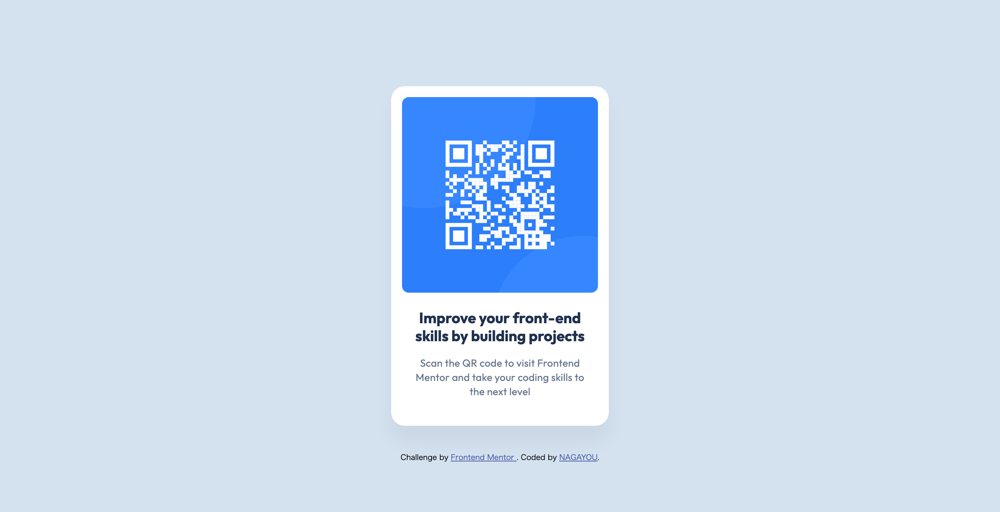

# Frontend Mentor - QR code component solution

This is a solution to the [QR code component challenge on Frontend Mentor](https://www.frontendmentor.io/challenges/qr-code-component-iux_sIO_H). Frontend Mentor challenges help you improve your coding skills by building realistic projects. 

## Table of contents

- [Frontend Mentor - QR code component solution](#frontend-mentor---qr-code-component-solution)
  - [Table of contents](#table-of-contents)
  - [Overview](#overview)
    - [Screenshot](#screenshot)
    - [Links](#links)
  - [My process](#my-process)
    - [Built with](#built-with)
    - [What I learned](#what-i-learned)
    - [Continued development](#continued-development)
    - [Useful resources](#useful-resources)
  - [Author](#author)

## Overview

### Screenshot

### Links

- Solution URL: [GitHub](https://github.com/nagayou/frontend-mentor/tree/main/qr-code-component-main)
- Live Site URL: [GitHub Page](https://nagayou.github.io/frontend-mentor/qr-code-component-main/)

## My process

### Built with

- Semantic HTML5 markup
- CSS custom properties
- Flexbox

### What I learned

- How to use CSS custom properties

### Continued development

- Semantic HTML markup methods
- Class naming conventions (such as BEM)
- Distinguishing between margin and padding

### Useful resources

- [Box Model  |  web.dev](https://web.dev/learn/css/box-model?continue=https%3A%2F%2Fweb.dev%2Flearn%2Fcss%23article-https%3A%2F%2Fweb.dev%2Flearn%2Fcss%2Fbox-model)

## Author

- GitHub - [NAGAYOU](https://github.com/nagayou)
- Frontend Mentor - [@nagayou](https://www.frontendmentor.io/profile/nagayou)
